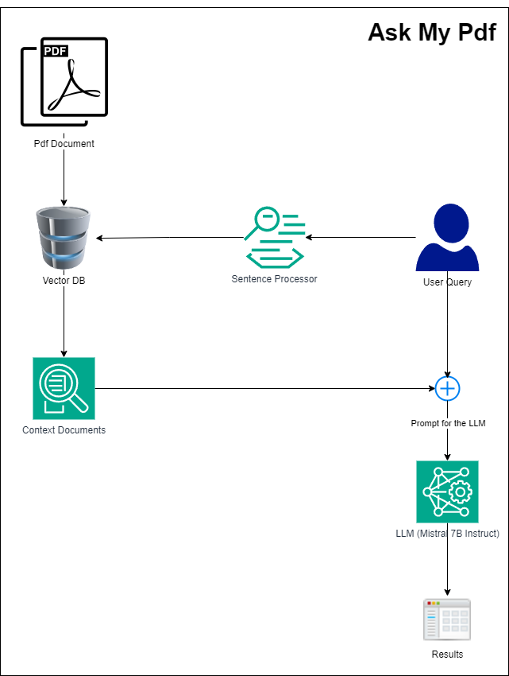

# Ask My Pdf

This is a project intended to use a RAG based approach to talk to pdf files, mostly useful in a research settings where reading papers is cumbersome with sometimes difficult words.

## Features

- Load a Pdf file to talk to.
- Provide an interface to talk with the pdf in an interactive manner.
- User shall post queries and should be able to:
  - Get a summary
  - Understand the core message of the Pdf, if multiple then summarize all of them.
  - Interact with the content and search internet for more resources.
- The system should run on a laptop (CPU mode compatible)

## Architecture

**Major Components:**

- **Vector DB: FAISS**
  - FAISS (Facebook AI Similarity Search) is a library that allows developers to quickly search for embeddings of multimedia documents that are similar to each other. It solves limitations of traditional query search engines that are optimized for hash-based searches, and provides more scalable similarity search functions. [(GitHub)](https://github.com/facebookresearch/faiss/wiki)

- **Sentence Processor: all-mpnet-base-v2**
  - This is a sentence-transformers model: It maps sentences & paragraphs to a 768 dimensional dense vector space and can be used for tasks like clustering or semantic search. [(Hugging Face)](https://huggingface.co/sentence-transformers/all-mpnet-base-v2)

- **Large Language Model: Mistral-7B-Instruct**
  - The Mistral-7B-Instruct-v0.3 Large Language Model (LLM) is an instruct fine-tuned version of the Mistral-7B-v0.3 [(Hugging Face)](https://huggingface.co/mistralai/Mistral-7B-Instruct-v0.3)
  - Mistral-7B-v0.3 has the following changes compared to Mistral-7B-v0.2:
    - Extended vocabulary to 32768.
    - Supports v3 Tokenizer.
    - Supports function calling.

## Architecture Diagram



## Usage

- Create the conda environment using

  ``` bash
    conda env create -f environment.yml
  ```

- Activate the conda environment
  
  ``` bash
    conda env create -f environment.yml
  ```

- Run the main file

  ``` bash
    python main.py
  ```

## Sample Chat with a Metrology Paper 

[Paper Link](https://www.ncbi.nlm.nih.gov/pmc/articles/PMC5453275/)


<!-- ``` bash

Enter your question: What is CAFM
Processing...
Filtered Answer: Conductive Atomic Force Microscopy (CAFM) is a type of microscopy used for imaging and quantifying defects in two-dimensional materials. It operates by measuring the conductance between the AFM tip and the sample, allowing for the visualization of defects based on their electrical properties. This technique can image every defect type observed by Scanning Tunneling Microscopy (STM), providing reliable defect quantification.

Enter your question: what type of sample was used to measure using CAFM?
Processing...
Filtered Answer: The sample used to measure using CAFM is a thick MoSe2 flake at the same location as the STM measurement. This information can be found in the first document provided in the context.

Enter your question: What is thick MoSe2 flake?
Processing...
Filtered Answer: The thick MoSe2 flake refers to a larger-scale defect in MoSe2 material, as mentioned in the context: "thickflake(atomic-scale smalldefect, only type 1 and 2) thickflake(10nm-scale largedefect)"

Enter your question: how was MoSe2 sample made in the methods section?
Processing...
Filtered Answer: The MoSe2 sample was synthesized using the self-flux method with excess Se. Specifically, Mo powder of 99.997% (99.999%) purity was loaded into a quartz ampule with Se shot of 99.999+% purity in metal-to-chalcogen molar ratios of 1:5 for MoSe2-A and ratios of 1:100 for WSe2-A and WSe2-B. The ampule was then evacuated to approximately 10^-5 Torr and sealed. Next, the ampule was heated to 1000 °C over 24 hours, held at that temperature for 2 weeks, and then cooled at a rate of 1°C/h to 500°C. After this, the cooling rate was increased to 5°C/h, and the ampule was cooled to room temperature. MoSe2-A went through an additional ramp, dwell, and cool thermal cycle. The TMD and excess selenium contents were transferred to a new quartz ampule, and a piece of quartz wool was added and pushed down to about 1 cm above the TMD crystals and excess selenium. The second ampule was sealed under vacuum at the end.

Enter your question: What is the diameter of the laser used in Raman?
Processing...
Filtered Answer: The diameter of the laser used in Raman measurements is about 1 micrometer (1 μm). This information can be found in the second document of the provided context: "The diameter of the laserspot was about 1μm," on page 6.

Enter your question: What is the spring constant of the CAFM tip
Processing...
Filtered Answer: The spring constant of the CAFM tip used in the study was not explicitly stated in the provided context. However, it is mentioned that a diamond-coated conductive tip manufactured by Budget Sensors (All-In-One DD) with a standard spring constant of 0.5 N/m or 6.5 N/m was utilized for the characterization presented in the main text.

Enter your question: was the ambient temperature 30?
Processing...
Filtered Answer: No, the ambient temperature was not mentioned as 30 degrees in the provided context. The temperature mentioned in the context is 285 degrees Celsius during certain processes and room temperature (not specified) during some other processes.
``` -->

## Changelogs

### v0.0.1 (feature + bug)

- First version of AskMyPdf released (CLI based).
- Pdfs are loaded via command line argument.
- LLM being used is MIstral-7B-v0.3 (instruction tuned).
- LLM is quantized to run in 4bit mode without anyfinetuning.
- RAG chain is build based on LangChain library.
- Vector DB is use is FAISS which is small in footprint and faster in terms of search.
- Hardware running the experimental setup RTX 3060 with 32 GB RAM.
- The processing time is too slow in this setup (BUG).

### v0.0.2 (feature)

- Added environment.yaml file for the dependencies.
