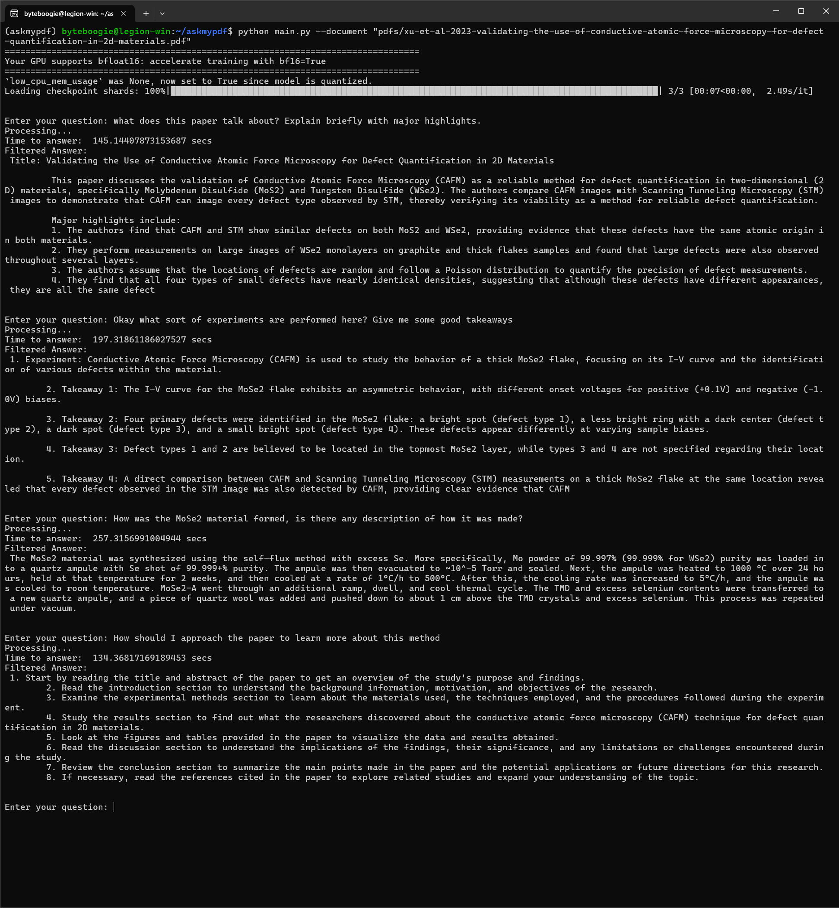
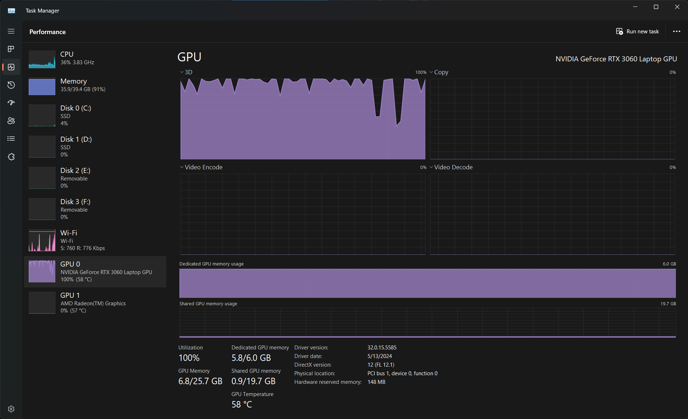

# Ask My Pdf

**Ask My Pdf** is a project designed to facilitate interactive engagement with PDF files, particularly useful for researchers dealing with complex papers.

## Features

- **Load a PDF**: Easily load a PDF file to interact with.
- **Interactive Interface**: Post queries and get responses:
  - Summarize the content
  - Understand the core messages
  - Interact with the content and search for more resources online
- **System Compatibility**: Optimized to run on a laptop (Still needs more optimization to run faster).

## Architecture

### Major Components

- **Vector DB: FAISS**
  - FAISS (Facebook AI Similarity Search) allows for scalable similarity searches of multimedia document embeddings.
  - [GitHub](https://github.com/facebookresearch/faiss/wiki)

- **Sentence Processor: all-mpnet-base-v2**
  - Maps sentences & paragraphs to a 768-dimensional dense vector space.
  - [Hugging Face](https://huggingface.co/sentence-transformers/all-mpnet-base-v2)

- **Large Language Model: Mistral-7B-Instruct**
  - An instruct fine-tuned version of Mistral-7B-v0.3.
  - Running the mistral model in 4-bit quantized mode.
  - [Hugging Face](https://huggingface.co/mistralai/Mistral-7B-Instruct-v0.3)

### Architecture Diagram


## System Requirements

- **CPU**: AMD Ryzen 7 5800H
- **GPU**: NVIDIA RTX 3060 (6GB VRAM)
- **RAM**: 32 GB

## Installation and Usage

1. **Download Huggingface Token** for authenticating and downloading model files.

    ```bash
    pip install -U "huggingface_hub[cli]"
    huggingface-cli login
    ```

2. **Create and Activate Conda Environment**

    ```bash
    conda env create -f environment.yml
    conda activate askmypdf
    ```

3. **Run the Application**

    ```bash
    python main.py
    ```

## Sample Interaction

**Paper**: [Metrology Paper](https://www.ncbi.nlm.nih.gov/pmc/articles/PMC5453275/)
  



## Changelogs

### v0.0.3

- Introduced FAISS GPU library.
- Updated environment file for Linux-based environments with CUDA support.

### v0.0.2

- Added environment.yaml file for dependencies.

### v0.0.1

- Initial release: CLI-based interaction with PDFs.
- Utilizes Mistral-7B-v0.3 (instruction tuned) quantized to run in 4-bit mode.
- Built RAG chain based on LangChain library.
- Implemented FAISS for vector search.
- Noted slow processing time (bug).
